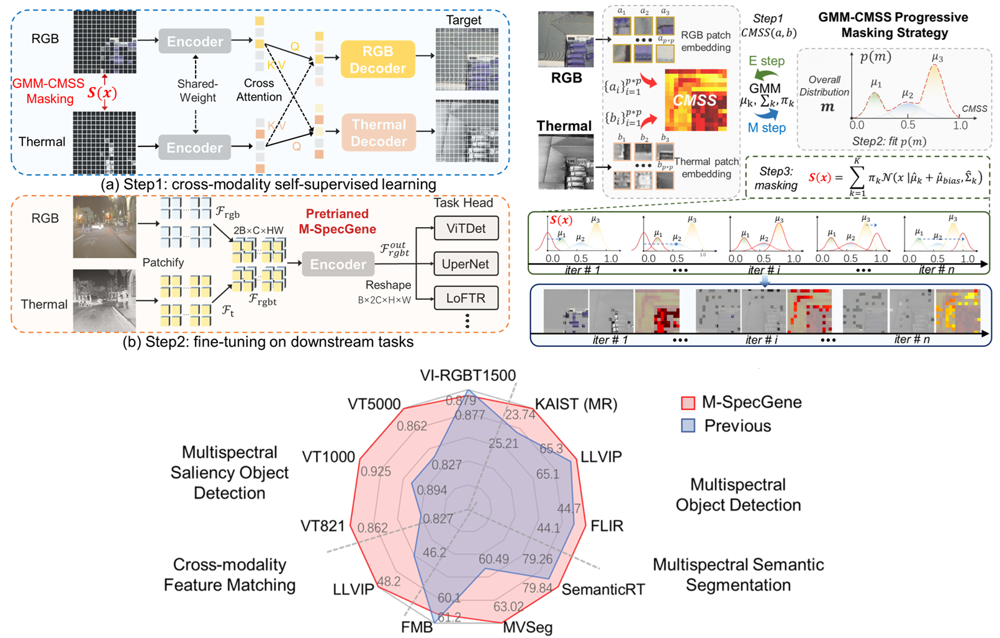
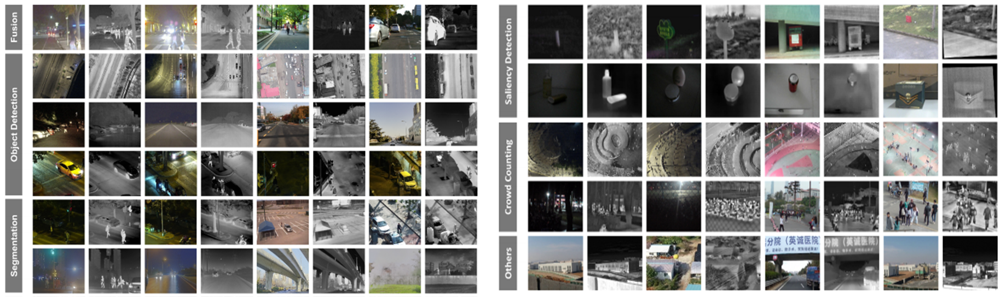

# M-SpecGene
M-SpecGene: Generalized Foundation Model for RGBT Multispectral Vision (ICCV 2025)

<p align="left">
  <a href='https://arxiv.org/abs/2507.16318'>
  </a> 
  <a href='https://huggingface.co/calayzhou/M-SpecGene'>
  </a>
  <a href='https://visitor-badge.laobi.icu/badge?page_id=calayzhou.M-SpecGene'>
  </a> 
   <a href='https://www.youtube.com/watch?v=4CJct1UalPU'>
   
   </a>
  

</p>


## Brief Introduction

RGB-Thermal (RGBT) multispectral vision is essential for robust perception in complex environments. Most RGBT tasks follow a case-by-case research paradigm, relying on manually customized models to learn task-oriented representations. Nevertheless, this paradigm is inherently constrained by artificial inductive bias, modality bias, and data bottleneck. To address these limitations, we make the initial attempt to build a Generalized RGBT MultiSpectral foundation model (M-SpecGene), which aims to learn modality-invariant representations from large-scale broad data in a self-supervised manner. M-SpecGene provides new insights into multispectral fusion and integrates prior case-by-case studies into a unified paradigm. Considering the unique characteristic of information imbalance in RGBT data, we introduce the Cross-Modality Structural Sparsity
(CMSS) metric to quantify the information density across two modalities. Then we develop the GMM-CMSS progressive masking strategy to facilitate a flexible, easy-to-hard, and object-centric pre-training process. Comprehensive experiments validate M-SpecGene’s generalizability across eleven datasets for four RGBT downstream tasks.


<div align="center" style="width:image width px;">
  
</div>


## RGBT550K Dataset
<div align="center" style="width:image width px;">
  
</div>

To pretrain a multispectral foundation model with robust generalization capabilities, we exert our utmost efforts to make a comprehensive collection of available RGBT datasets. The  multispectral (RGBT) image datasets can be found at [A Summary of Multispectral (RGBT) Image Datasets](https://github.com/CalayZhou/A-Summary-of-Multispectral-Image-Datasets). Our meticulous collection and preprocessing yields RGBT550K, a comprehensive dataset comprising 548,238 high-quality samples. It encompasses diverse scenarios, tasks, lighting conditions, resolutions, and object categories, providing a solid foundation for the self-supervised pre-training of the multispectral foundation model. You can download the RGBT550K dataset from  [Baidu Cloud (code: rwf7)](https://pan.baidu.com/s/1Hv3E74ILsk_rmbQVXDpr6w?pwd=rwf7) or [One Dirve](https://smailnjueducn-my.sharepoint.com/:f:/g/personal/calayzhou_smail_nju_edu_cn/EjVdEZ6zjzJHk2Q8n8Swgl8BAqEPVg3jbN62Y096PXlRwQ?e=CCImyC).

```
# RGBT550K Usage
sudo apt install p7zip-full
7z x RGBT550K_archive.7z.partaa
```

## Pretrained Models

### a) Pretrained Foundation Model
| Foundation Model | Backbone | Model Weights |
|:----------------------------| :------: |:-------------:|
| M-SpecGene                  | ViT-B |     [M-SpecGene_VIT-B.pth](https://drive.google.com/file/d/1COVlrnQPoqFjK-aJpSvNb3diSDblw0nb/view?usp=sharing)            | 


### b) Transform of M-SpecGene for Training on Downstream Tasks
Since the above pretrained foundation model M-SpecGene retains all parameters during
self-supervised training, we extract the encoder  for detection (ViTDet) and segmentation (UperNet) task.
```
cd tool
python M-SpecGeneTransform_det.py  # M-SpecGene_VIT-B_det_transform.pth
python M-SpecGeneTransform_seg.py  # M-SpecGene_VIT-B_seg_transform.pth
```

| Task         | Backbone |             Model Weights              |
|:-------------| :------: |:--------------------------------------:|
| Detection    | ViT-B | [M-SpecGene_VIT-B_det_transform.pth](https://drive.google.com/file/d/111OG0Ejv8pd8nLdLs74f1rq7NgvSTd8e/view?usp=sharing) | 
| Segmentation | ViT-B | [M-SpecGene_VIT-B_seg_transform.pth](https://drive.google.com/file/d/1xUH48fAqTtznNHh0B_WG04ww5ps0BdNk/view?usp=drive_link) | 

### c) Trained Models for Different RGBT Datasets 

| Task         |    Dataset     |                                               Trained Models                                                |  Performance  |
|:-------------|:--------------:|:-----------------------------------------------------------------------------------------------------------:|:-------------:|
| Detection    |   [KAIST](https://drive.google.com/file/d/1UpIfZkqH1ry-252HVF_iUDXJX3GcYYvR/view?usp=sharing)    |                                          [KAIST_iter_25000.pth](https://drive.google.com/file/d/11r9a6jzPY3Nc3COGNQFCCN54cMeU27hk/view?usp=sharing)                                           | MR^-2  23.74 |
| Detection    |   [LLVIP](https://drive.google.com/file/d/1vUY8zr5RaQvs0Umz4nQCCU5pEkSkWAtw/view?usp=sharing)    |                                          [LLVIP_iter_105625.pth](https://drive.google.com/file/d/1aj-StAKpbd_5dq4LDaygLXhn0JHqQZxU/view?usp=sharing)                                          |   mAP 65.3%   | 
| Detection    |    [FLIR](https://drive.google.com/file/d/1vZy7AncoXVOd4kp1Tc24PzvzidwSgXfq/view?usp=drive_link)    |                                           [FLIR_iter_90000.pth](https://drive.google.com/file/d/1flAlTnelAcnLa60FP38kJJ0o-8Y4a7v6/view?usp=sharing)                                           |   mAP 44.7%   | 
| Segmentation | [SemanticRT](https://drive.google.com/file/d/16rrFDl468R3TGp-C3bPkwVSlhElIAh-4/view?usp=sharing) |  [SRT_iter_320000.pth](https://drive.google.com/file/d/1vEuW_a3n7_-IXpphOQnJv5CMZFGW_N9y/view?usp=sharing)  |  mIoU 79.84%  | 
| Segmentation |   [MVSEG](https://drive.google.com/file/d/1AM0ln1ZzDQ_9nHolfMNugyHS6Ls2pHbZ/view?usp=sharing)    | [MVSEG_iter_240000.pth](https://drive.google.com/file/d/1INkxRRygPObU3-WIVx84CT42p_LczXb6/view?usp=sharing) |  mIoU 63.02%  |
| Segmentation |    [FMB](https://drive.google.com/file/d/11n_S8SMD2mSzWYw-V8Bhmu_jhnkXAl7-/view?usp=drive_link)     |  [FMB_iter_224000.pth](https://drive.google.com/file/d/1tP1sCzEdBya2G3sWEggglKkxrNX94NGC/view?usp=sharing)  |   mIoU ~60%   |
| SOD          |   [VT5000](https://drive.google.com/file/d/1b2lHWzamigAJ6cGG3Uh88hRhcggVDrQm/view?usp=sharing)    |    [VT5000_iter_54000.pth](https://drive.google.com/file/d/1ZW17poat3_9ze8tsZ5Y3jTJFC0Mj4ewx/view?usp=sharing)     |  S 0.892, MAE 0.028  |


## Usage
### Pretraining
a. RGBT550K dataset
```
# link the dataset
cd pretrain/mmpretrain-main_rgbt
ln -s /path/to/RGBT_CLEAN_v6/ir  ./data/imagenet
ln -s /path/to/RGBT_CLEAN_v6/rgb  ./data/imagenet2
```
b. preparation

Please refer to [mmpretrain](https://mmpretrain.readthedocs.io/en/latest/get_started.html) documentation for more detailed installation,
and download [mae_single_modality_in148w_t48w_vit-b_epoch_400_dual_decoder.pth](https://drive.google.com/file/d/1NCFUir4v_0apbhlHnLRHHiJ64Q7lCkTK/view?usp=sharing) to `./work_dirs/mae_vit-base-p16_8xb512-amp-coslr-500e_in1k_siam/`
```
# after installation
mim install -e .
```


c. cross-modality self-supervised pretraining
```
bash tools/dist_train.sh configs/mae/mae_vit-base-p16_8xb512-amp-coslr-500e_in1k_siam.py 8
```


### Finetuning

#### 1) RGBT Multispectral Object Detection
a. dataset preparation

PLease download the   [FLIR](https://drive.google.com/file/d/1vZy7AncoXVOd4kp1Tc24PzvzidwSgXfq/view?usp=drive_link) ,  [LLVIP](https://drive.google.com/file/d/1vUY8zr5RaQvs0Umz4nQCCU5pEkSkWAtw/view?usp=sharing)    and  [KAIST](https://drive.google.com/file/d/1UpIfZkqH1ry-252HVF_iUDXJX3GcYYvR/view?usp=sharing)   datasets to the proposal path.
```
# link the dataset (FLIR by default)
cd det/mmdetection_rgbt
ln -s /path/to/COCO_FLIR/FLIR_ir  ./data/FLIR/coco
ln -s /path/to/COCO_FLIR/FLIR_rgb  ./data/FLIR/coco2
```

b. installation

Please refer to [mmdetection get_started.md](https://mmdetection.readthedocs.io/en/latest/get_started.html)
for installation. You can also refer to the [mmdet_env_refer.txt](./det/mmdetection_rgbt/mmdet_env_refer.txt) to check the version.
```
# after installation
cd det/mmdetection_rgbt
pip install -v -e .
```
c. evalution  (FLIR by default)
```
python tools/test.py projects/ViTDet/configs/vitdet_mask-rcnn_vit-b-mae_lsj-100e.py /path/to/FLIR_iter_90000.pth
```

d. train (FLIR by default)

Please download the  [M-SpecGene_VIT-B_det_transform.pth](https://drive.google.com/file/d/111OG0Ejv8pd8nLdLs74f1rq7NgvSTd8e/view?usp=sharing), and change the pretrained model path in `projects/ViTDet/configs/vitdet_mask-rcnn_vit-b-mae_lsj-100e.py`
```
bash tools/dist_train.sh projects/ViTDet/configs/vitdet_mask-rcnn_vit-b-mae_lsj-100e.py 2
```
e. evalution or train on the other datasets
```
1. change the dataset link in ./data  and data_root (line 7) in projects/ViTDet/configs/lsj-100e_coco-instance_5w.py
2. change num_classes (FLIR->3, LLVIP->1, KAIST->1) in ./configs/_base_/models/mask-rcnn_r50_fpn.py (line 54 73)
3. change the name of ann_file in ./projects/ViTDet/configs/lsj-100e_coco-instance_5w.py
4. train or evalution as above
```
For MR^-2 metric evalution on KAIST, please use the `KAISTdevkit-matlab-wrapper` from [MBNet](https://github.com/CalayZhou/MBNet).
```
#  MR^-2 metric for KAIST
1. Please uncommet line 388~406 in  mmdet/evaluation/metrics/coco_metric.py  
2. change dataset link&root, num_classes, ann_file and run the tool/test.py as above
3. txt file will be save at data/result 
4. open the KAISTdevkit-matlab-wrapper and run the demo_test.m
```


#### 2) RGBT Multispectral Semantic Segmentation


a. dataset preparation

PLease download the  [SemanticRT](https://drive.google.com/file/d/16rrFDl468R3TGp-C3bPkwVSlhElIAh-4/view?usp=sharing),  [MVSEG](https://drive.google.com/file/d/1AM0ln1ZzDQ_9nHolfMNugyHS6Ls2pHbZ/view?usp=sharing) and  [FMB](https://drive.google.com/file/d/11n_S8SMD2mSzWYw-V8Bhmu_jhnkXAl7-/view?usp=drive_link)  datasets to the proposal path.
```
# link the dataset (MVSEG by default)
cd seg/mmsegmentation-main-rgbt
ln -s /path/to/MVSEG_ALL/MVSEG  ./data/ade/ADEChallengeData2016
ln -s /path/to/MVSEG_ALL/MVSEG_T  ./data/ade/ADEChallengeData2016_T
```
b. installation

Please refer to [mmsegmentation-v1.2.2 get_started.md](https://github.com/open-mmlab/mmsegmentation/blob/v1.2.2/docs/en/get_started.md#installation)
for installation. You can also refer to the [mmseg_env_refer.txt](./seg/mmsegmentation-main-rgbt/mmseg_env_refer.txt) to check the version.

```
# after installation
cd seg/mmsegmentation-main-rgbt
pip install -v -e .
```
c. evalution  (MVSEG by default)
```
python tools/test.py configs/mae/mae-base_upernet_8xb2-amp-320k_ade20k-768x768.py /path/to/MVSEG_iter_240000.pth
```

d. train (MVSEG by default)

Please download the [M-SpecGene_VIT-B_seg_transform.pth](https://drive.google.com/file/d/1xUH48fAqTtznNHh0B_WG04ww5ps0BdNk/view?usp=drive_link), and change the pretrained model path in `configs/mae/mae-base_upernet_8xb2-amp-320k_ade20k-768x768.py`
```
bash tools/dist_train.sh configs/mae/mae-base_upernet_8xb2-amp-320k_ade20k-768x768.py 2
```

e. evalution or train on the other datasets

```
1. change the dataset link in /dataset/ade/
2. change the mmseg/datasets/ade.py (refer to ade_FMB.py ade_MVSEG.py ade_SRT.py)
3. change num_classes (FMB->15, MVSEG->26, SRT->13) in configs/mae
/mae-base_upernet_8xb2-amp-320k_ade20k-768x768.py
4. train or evalution as above
```


#### 3) RGBT Multispectral Saliency Object Detection

a. dataset preparation

PLease download the  [VT5000](https://drive.google.com/file/d/1b2lHWzamigAJ6cGG3Uh88hRhcggVDrQm/view?usp=sharing),  [VT1000](https://drive.google.com/file/d/1_8FxwWjbK4SdBEMhDlXn_80sa9cO_xPe/view?usp=sharing) ,  [VT821](https://drive.google.com/file/d/12P-8XSZ_D2Aa98xSn0H8vixdx7O7PxnN/view?usp=sharing) and  [VIRGBT-1500](https://drive.google.com/file/d/1mEUNWYOqi9BM2oiB25O-iL5dtcMgnLZf/view?usp=sharing)  datasets to the proposal path.
```
# link the dataset (VT5000 by default)
cd sod/mmsegmentation-main-rgbt
ln -s /path/to/VT5000_ALL/VT5000  ./data/ade/ADEChallengeData2016
ln -s /path/to/VT5000_ALL/VT5000_T  ./data/ade/ADEChallengeData2016_T
```
b. installation

This part is the same with 2) RGBT Multispectral Semantic Segmentation.

c. evalution  (VT5000 by default)
```
1. python tools/test.py configs/mae/mae-base_upernet_8xb2-amp-160k_ade20k-768x768.py /path/to/VT5000_iter_54000.pth --out ./pred_mask/54000/VT5000
2. cd ../SOD_Evaluation_Metrics-main
3. cp -r ../mmsegmentation-main-rgbt/pred_mask ./
4. cp -r /path/to/VT5000_ALL/VT5000/annotations/validation ./gt/VT5000
4. python 01to0255.py  # To ensure the labels are 0/255 since the SOD_Evaluation_Metrics-main requires the labels to be 0/255 rather than 0/1.(Please change the file path in 01to0255.py)
5. python main.py  # Please ensure the directory structure in pred_mask/54000 matches that of gt/.
```

d. train (VT5000 by default)

Please download the [M-SpecGene_VIT-B_seg_transform.pth](https://drive.google.com/file/d/1xUH48fAqTtznNHh0B_WG04ww5ps0BdNk/view?usp=drive_link), and change the pretrained model path in `configs/mae/mae-base_upernet_8xb2-amp-160k_ade20k-768x768.py`
```
bash tools/dist_train.sh configs/mae/mae-base_upernet_8xb2-amp-160k_ade20k-768x768.py 2
```

e. evalution on the other datasets

```
1. change the dataset link in /dataset/ade/
2. evalution as above
```


## Citation

If you find this repository useful in your research, please consider giving a star ⭐ and a citation.
```
@article{zhou2025m,
  title={M-SpecGene: Generalized Foundation Model for RGBT Multispectral Vision},
  author={Zhou, Kailai and Yang, Fuqiang and Wang, Shixian and Wen, Bihan and Zi, Chongde and Chen, Linsen and Shen, Qiu and Cao, Xun},
  journal={Proceedings of the IEEE/CVF International Conference on Computer Vision (ICCV)},
  year={2025}
}
```
